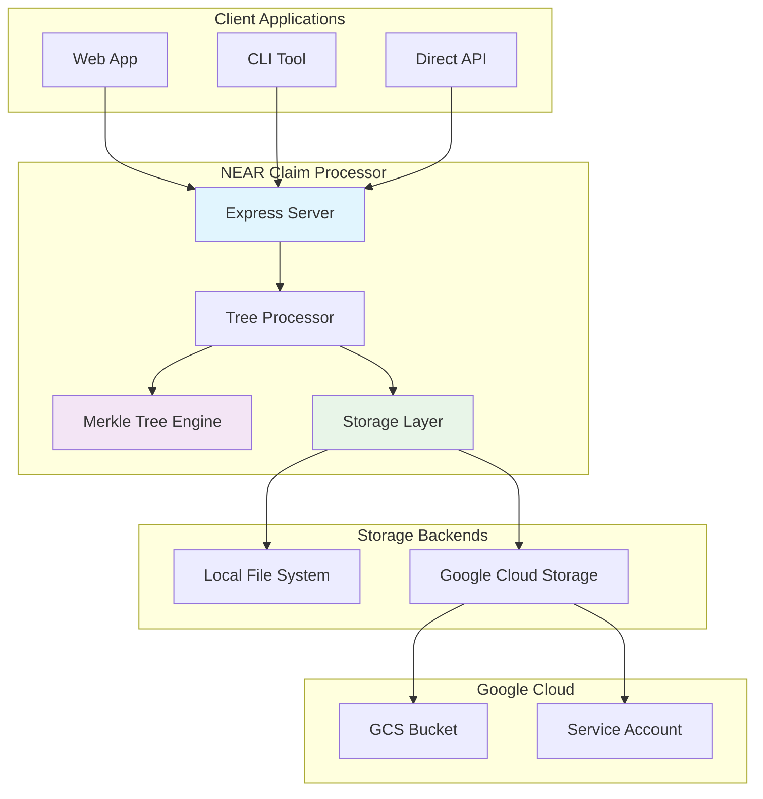
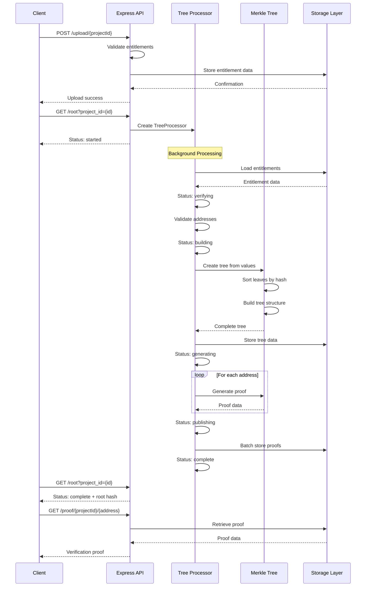
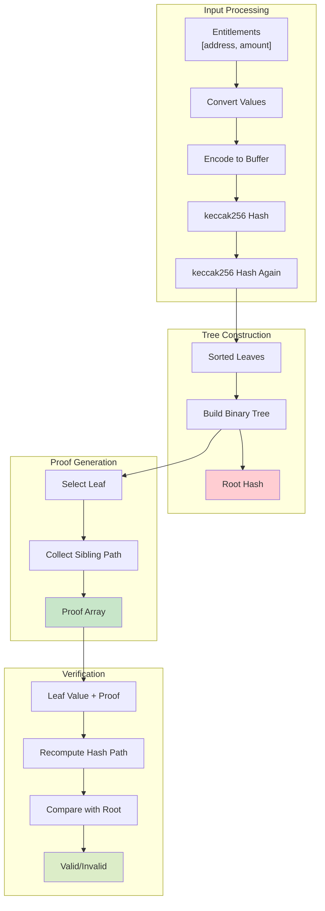

# NEAR Protocol Claim List Processor

A TypeScript-based claim list processor adapted to work with NEAR Protocol. This processor creates Merkle trees for token distribution and generates individual proofs for each eligible address.

## Features

- **NEAR-compatible Merkle trees**: Uses keccak256 hashing
- **Flexible storage**: Supports both Google Cloud Storage and local file storage
- **Async processing**: Handles large datasets efficiently with chunked processing
- **REST API**: Express-based API for managing claim processing
- **Batch operations**: Optimized for processing thousands of claims

## Architecture

1. **Hashing Algorithm**:

   keccak256

2. **Storage Layer**:

   Google Cloud Storage + local fallback

3. **Address Format**:

   Account IDs (.near) or implicit accounts (64-char hex)

4. **Data Encoding**:
   Length-prefixed UTF-8 encoding

## Setup

### Installation

```bash
# Install dependencies
npm install

# Copy environment template
cp .env.example .env

# Configure your environment
# Edit .env with your NEAR configuration
```

### Environment Configuration

```env
# For local development (recommended for testing)
USE_LOCAL_STORAGE=true
DATA_PATH=./data
PORT=8000

# For Google Cloud Storage (production)
USE_LOCAL_STORAGE=false
GCS_PROJECT_ID=your-gcs-project
GCS_BUCKET=claim-processor-storage
GOOGLE_APPLICATION_CREDENTIALS_JSON=???
DATABASE_URL=???
```

## Usage

### Development Mode

```bash
# Start with TypeScript compilation
npm run dev
```

### Production Mode

```bash
# Build and run
npm run build
npm start
```

## API Endpoints

### 1. Upload Entitlements

```bash
POST /upload/:projectId
Content-Type: application/json

{
  "entitlements": [
    {"address": "alice.near", "amount": "1000000000000000000000"},
    {"address": "bob.near", "amount": "2000000000000000000000"}
  ]
}
```

### 2. Process Claims

```bash
GET /root?project_id=my-project
```

Response:

```json
{
  "status": "complete",
  "projectId": "my-project",
  "root": "0x1234...",
  "numEntitlements": 1000,
  "totalClaimValue": "1000000000000000000000000",
  "generated": 1000
}
```

### 3. Get Individual Proof

```bash
GET /proof/:projectId/:address
```

Response:

```json
{
  "value": ["alice.near", "1000000000000000000000"],
  "treeIndex": 42,
  "proof": ["0x1234...", "0x5678...", "0x9abc..."]
}
```

### 4. Get Tree Data

```bash
GET /tree/:projectId
```

### 5. List Projects

```bash
GET /projects
```

## Verification

To verify a proof on NEAR:

```typescript
import { NearMerkleTree } from "./src/merkle-tree";

// Load tree and verify proof
const tree = NearMerkleTree.load(treeData);
const isValid = tree.verify(proof, ["alice.near", "1000000000000000000000"]);
```

## Testing

```bash
# Run tests (when implemented)
npm test
```

## Production Deployment

1. Set up Google Cloud Storage bucket and service account
2. Configure environment variables for GCS access
3. Deploy processor service to your preferred platform
4. Set up monitoring and logging

## Performance

- Handles 1M+ claims efficiently with chunked processing
- Async/await pattern prevents blocking
- Batch storage operations for better performance
- Memory-efficient tree construction

## Security

- Validates input data before processing
- Secure NEAR key management
- Error handling for malicious inputs
- Rate limiting recommended for production

## NEAR Claim Processor Architecture Diagrams

### 1. System Architecture Overview



### 2. Data Flow - Claim Processing Workflow



### 3. Merkle Tree Structure and Operations


