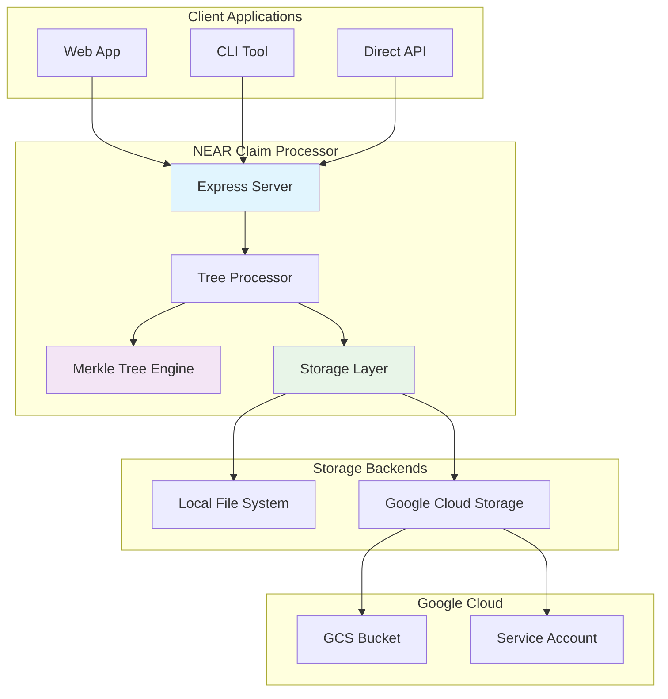
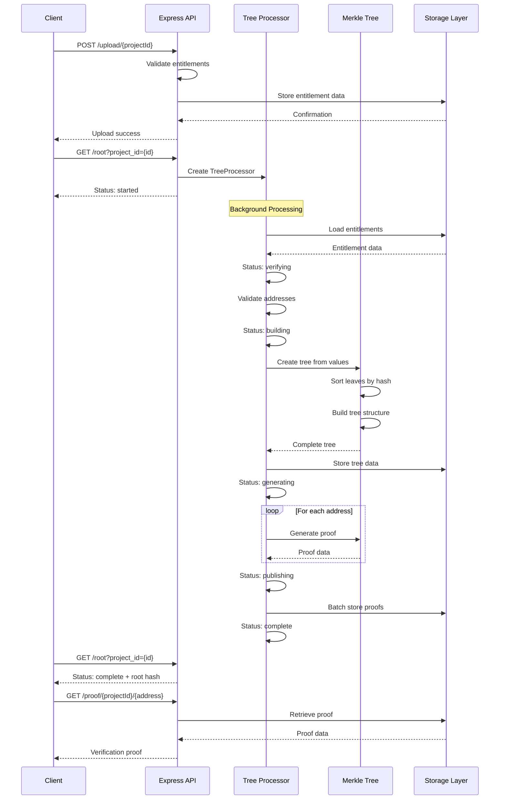
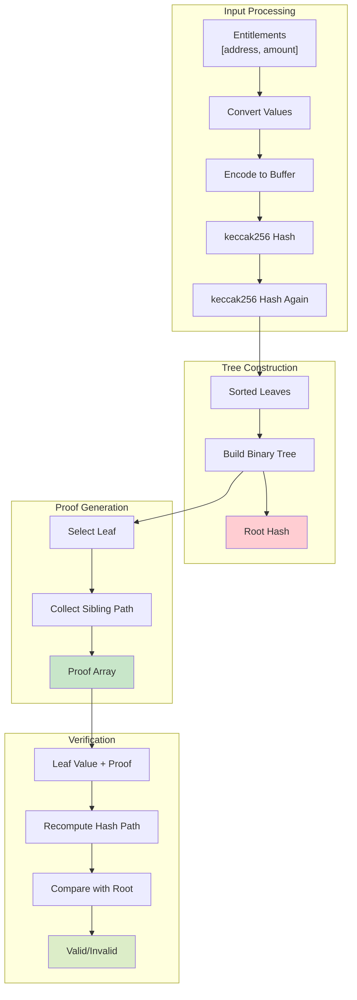

# NEAR Claim Processor Architecture Diagrams

## 1. System Architecture Overview

## 2. Data Flow - Claim Processing Workflow

## 3. Merkle Tree Structure and Operations

## Key Features Highlighted:

1. **Modular Architecture**: Clean separation between API, processing, storage, and cryptographic components
2. **Flexible Storage**: Support for both local development and Google Cloud Storage for production
3. **Async Processing**: Non-blocking tree generation and proof creation
4. **Comprehensive Testing**: Unit, integration, and performance tests
5. **Error Resilience**: Proper error handling and status tracking
6. **Scalable Design**: Handles large datasets efficiently with chunked processing
